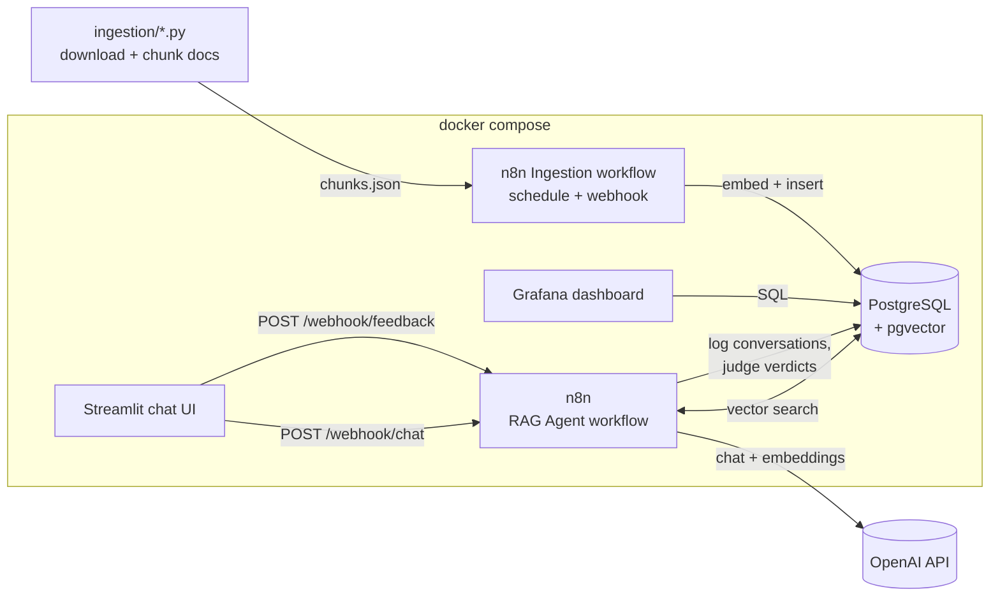

# n8n Docs Assistant

An internal **platform-support chatbot** that answers "How do I … in n8n?"
questions from the **official n8n documentation** — built end-to-end with
**self-hosted n8n** as the orchestration and RAG runtime.

> LLM Zoomcamp capstone project. The whole stack (n8n, PostgreSQL + pgvector,
> Grafana, Streamlit) runs locally with one `docker compose up`.

<!-- TODO(screenshot): images/streamlit-ui.png - the Streamlit chat with an answered question -->


## Problem statement

Companies that roll out a workflow-automation platform like [n8n](https://n8n.io)
quickly accumulate the same support questions over and over: *"How do I loop
over items?"*, *"How do I merge two branches?"*, *"Can the Code node use
external libraries?"*. The platform team answers them by hand, usually by
searching the docs and pasting links.

This project automates that first support level. Employees ask questions in a
chat UI; an **AI agent retrieves relevant chunks of the official n8n
documentation from a vector database and answers with citations**. If the
docs don't contain the answer, the assistant says so instead of guessing.
Every conversation is logged, automatically rated by an LLM judge, and can be
rated by users (👍/👎) — all visible on a Grafana monitoring dashboard.

A deliberate twist: the RAG flow itself is **built in n8n**. The tool the bot
explains is the tool it runs on, and the project doubles as a hands-on n8n
tutorial.


## Architecture



| Component | Technology | Role |
|---|---|---|
| Knowledge base | PostgreSQL 17 + [pgvector](https://github.com/pgvector/pgvector) 0.8.5 | Stores doc chunks + embeddings (`n8n_vectors`) and the monitoring tables |
| RAG runtime & orchestration | [n8n](https://n8n.io) 2.31.2 (self-hosted) | Three workflows: ingestion, RAG agent API, feedback capture |
| LLM & embeddings | OpenAI (`gpt-5.4-mini`, `text-embedding-3-small`) | Answering, judging, embedding |
| Interface | Streamlit + n8n webhooks (REST API) | Chat UI with 👍/👎 feedback |
| Monitoring | Grafana 13 | 7-panel dashboard over the Postgres monitoring tables |
| Evaluation | Jupyter notebooks (Python, uv) | Retrieval + RAG evaluation (offline) |

**What is n8n?** n8n is an open-source workflow-automation platform
(comparable to Zapier or Airflow, with a visual editor). Workflows are
graphs of nodes; triggers (webhooks, schedules) start executions. Its
LangChain-based AI nodes provide agents, vector stores, and embeddings as
drag-and-drop building blocks. In this project n8n plays the role that
Flask + a cron job played in the course's example project: it exposes the
API, runs the agentic RAG flow, and schedules ingestion. It was chosen
deliberately to learn n8n on an enterprise-style use case.


## The RAG flow (agentic)

The core workflow `2 - RAG Agent API` ([n8n/workflows/rag-agent.json](n8n/workflows/rag-agent.json)):

1. **Webhook** receives `{"question": "..."}`
2. A **Code node** validates the input and starts a latency timer
3. An **AI Agent** node (tools agent) answers the question. It has one tool:
   `n8n_docs_search` — a **PGVector vector store** (top-5, cosine) with OpenAI
   embeddings. The agent decides *when and what* to search and may search
   multiple times with different queries (module 1: agentic RAG). The system
   prompt enforces grounding: answer only from retrieved docs, cite sources,
   admit when the answer isn't there.
4. A **Code node** builds a monitoring record (latency, token/cost estimates)
5. A **Postgres node** logs the conversation, then the **webhook responds**
6. *After* the response is sent, an **LLM judge** (Basic LLM Chain) classifies
   the answer as RELEVANT / PARTLY_RELEVANT / NON_RELEVANT and stores the
   verdict — live quality monitoring at no latency cost (module 5, lesson 9)

<!-- TODO(screenshot): images/n8n-rag-workflow.png - the workflow canvas in the n8n editor -->


## Dataset

The knowledge base is a pinned subset of the official
[n8n-docs](https://github.com/n8n-io/n8n-docs) repository (commit
`f83df2c657`, 2026-07-16): the `docs/build/**` and `docs/get-started/**`
sections — everything about building workflows, flow logic, code,
expressions, data handling, and n8n's AI features.

- **122 documents → 589 chunks** (avg ~750 chars)
- Chunking: one markdown file = one *document* (`doc_id`), split at H2
  headings into *sections*; long sections are packed paragraph-by-paragraph
  into chunks of ≤1500 chars (`chunk_id = doc_id#n`). Each chunk keeps
  `title`, `section`, and the live docs `url` as metadata, and the chunk text
  is prefixed with `title / section` for context.
- The docs are Apache 2.0 + Commons Clause licensed, so the raw files are
  **not** committed; `ingestion/download_docs.py` fetches the pinned commit
  reproducibly. The processed [`data/chunks.json`](data/chunks.json) and the
  generated [`data/ground-truth.csv`](data/ground-truth.csv) are committed.


## How to run

Prerequisites: Docker (with Compose), [uv](https://docs.astral.sh/uv/),
an OpenAI API key. `make` is convenient but optional — every target is a
one-liner you can copy from the [Makefile](Makefile).

```bash
# 1. configure secrets
cp .env.example .env          # then edit: set OPENAI_API_KEY, passwords,
                              # and N8N_ENCRYPTION_KEY (openssl rand -hex 24)

# 2. install python deps + build the knowledge base file (data/chunks.json)
uv sync
make prepare-data

# 3. start everything (n8n + Postgres + Grafana + Streamlit)
make up

# 4. load the knowledge base into pgvector (runs the n8n ingestion workflow)
make ingest                   # ~1-2 min; watch progress with: make logs
```

Then open:

| URL | What | Login |
|---|---|---|
| http://localhost:8501 | **Chat UI** (Streamlit) | — |
| http://localhost:5678 | n8n editor (see the workflows live) | create owner account on first visit |
| http://localhost:3000 | Grafana monitoring dashboard | `admin` / `admin` (from `.env`) |

Try it from the command line:

```bash
make ask
# or:
curl -X POST http://localhost:5678/webhook/chat \
  -H 'Content-Type: application/json' \
  -d '{"question": "How do I loop over items in n8n?"}'
```

Example response:

```json
{
  "conversation_id": "3",
  "answer": "In n8n, you usually don't need to build a loop manually because nodes
  typically process all incoming items automatically. If you do need looping:
  1. Use the Loop Over Items node ... Sources: https://docs.n8n.io/build/flow-logic/loop/"
}
```

The workflows and credentials are **imported and published automatically** on
first start (`n8n-import` one-shot container, see
[n8n/import.sh](n8n/import.sh)) — credentials are generated from `.env`, so
no secrets live in the repo.

To run the evaluation notebooks (stack must be running):

```bash
uv run jupyter lab notebooks/
```


## Evaluation

All evaluation is offline, in [notebooks/](notebooks/), following the
module 4 methodology. Ground truth: for 150 randomly sampled chunks, an LLM
generated 3 questions each → **450 question–chunk pairs**
([notebook 1](notebooks/1-ground-truth.ipynb), committed as
[`data/ground-truth.csv`](data/ground-truth.csv)).

### Retrieval evaluation

[Notebook 2](notebooks/2-retrieval-evaluation.ipynb) compares **three
approaches** against the *same* pgvector table the live flow uses, at two
granularities (exact chunk / right docs page), top-5:

| Approach | Hit Rate (chunk) | MRR (chunk) | Hit Rate (doc) | MRR (doc) |
|---|---|---|---|---|
| Full-text (Postgres `ts_rank`, OR semantics) | 0.653 | 0.472 | 0.776 | 0.599 |
| **Vector (pgvector, prod setup)** | **0.904** | **0.781** | **0.936** | **0.861** |
| Hybrid + RRF re-ranking | 0.889 | 0.672 | 0.924 | 0.763 |

**Vector search wins on every metric** — and it's exactly what the live n8n
flow uses (PGVector *retrieve-as-tool*), so offline evaluation and production
agree. Full-text lags because ground-truth questions are paraphrased (little
keyword overlap); hybrid doesn't beat pure vector here because fusing in the
weaker text ranking dilutes it. Details and the RRF implementation are in the
notebook.

### RAG evaluation (LLM as a Judge)

[Notebook 3](notebooks/3-rag-evaluation.ipynb) generates answers for 100
ground-truth questions with **two prompt variants** (course-style *strict*
prompt vs. the production *guided* prompt) and judges every answer:

| Verdict | strict | **guided (production)** |
|---|---|---|
| RELEVANT | 93% | **97%** |
| PARTLY_RELEVANT | 6% | 3% |
| NON_RELEVANT | 1% | 0% |

The **guided prompt wins** and is what the production n8n workflow uses in
its system message.

It also measures **LLM query rewriting** (best-practices point) — with an
honest negative result: rewriting lowered the doc-level hit rate from 0.95
to 0.87, because ground-truth questions are already precise. The live flow
therefore has no fixed rewrite step; the n8n *agent* still formulates its own
tool queries dynamically, which covers the messy-real-query case rewriting
is meant for.


## Monitoring

> 📚 *If you haven't done module 5 yet:* monitoring answers the question
> offline evaluation can't — *how does the system behave with real users?*
> The pattern is: log every conversation to a database, collect explicit
> feedback, add an automatic quality signal (LLM judge), and put a dashboard
> on top. This project implements exactly that pattern; the mapping to the
> module 5 lessons is in [docs/monitoring.md](docs/monitoring.md).

- Every conversation is logged by the n8n workflow to the `conversations`
  table: question, answer, model, **latency**, **token estimates**,
  **cost estimate**, and (asynchronously) the **LLM judge verdict**.
- 👍/👎 buttons in Streamlit post to the feedback webhook → `feedback` table.
- **Grafana** auto-provisions a dashboard with **7 panels**: conversations
  per hour, user feedback, judge relevance, latency (avg/p95), token usage
  per day, total cost, recent conversations.

<!-- TODO(screenshot): images/grafana-dashboard.png - the dashboard with some traffic on it -->

*Note on token numbers:* n8n's Agent node doesn't expose exact API token
usage, so the workflow logs a documented estimate (~4 chars/token + fixed
context envelope). The evaluation notebooks use exact usage from the API.


## Ingestion pipeline

Fully automated, two stages:

1. **Corpus preparation** (Python, [ingestion/](ingestion/)):
   `download_docs.py` fetches the pinned docs commit, `prepare_chunks.py`
   cleans mkdocs markup and chunks → `data/chunks.json`. Deterministic and
   re-runnable (`make prepare-data`).
2. **Loading** (n8n workflow `1 - Ingest n8n Docs`): triggered by a **weekly
   schedule** or on demand via webhook (`make ingest`). It wipes the old
   chunks, reads `chunks.json`, embeds every chunk with OpenAI, and inserts
   into pgvector — idempotent end to end.


## Best practices (rubric extras)

- **Hybrid search** — evaluated in notebook 2 (full-text + vector via RRF)
- **Document re-ranking** — Reciprocal Rank Fusion implemented and evaluated
  in notebook 2
- **User query rewriting** — evaluated in notebook 3; the live agent also
  rewrites queries implicitly when it formulates tool calls


## Project structure

```
n8n-docs-assistant/
├── docker-compose.yaml       # the whole stack, pinned versions
├── .env.example              # all configuration (copy to .env)
├── Makefile                  # prepare-data / up / ingest / ask / psql
├── ingestion/                # corpus preparation scripts (python)
├── data/                     # chunks.json + ground-truth.csv (committed)
├── n8n/
│   ├── workflows/            # the 3 workflows as importable JSON
│   └── import.sh             # auto-import + publish on first start
├── postgres/init.sql         # pgvector extension + monitoring tables
├── streamlit/                # chat UI (app.py + Dockerfile)
├── grafana/                  # auto-provisioned datasource + dashboard
├── notebooks/                # evaluation (ground truth, retrieval, RAG)
└── docs/                     # extra docs (monitoring explainer)
```


## Evaluation criteria mapping

For reviewers — where to find each criterion:

| Criterion | Where |
|---|---|
| Problem description | this README, [Problem statement](#problem-statement) |
| Retrieval flow (KB + LLM) | agentic RAG in n8n: [rag-agent.json](n8n/workflows/rag-agent.json), [The RAG flow](#the-rag-flow-agentic) |
| Retrieval evaluation (multiple) | [notebook 2](notebooks/2-retrieval-evaluation.ipynb): full-text vs vector vs hybrid+RRF |
| LLM evaluation (multiple) | [notebook 3](notebooks/3-rag-evaluation.ipynb): 2 prompts × LLM judge + query rewriting |
| Interface | Streamlit UI **and** REST API (n8n webhook) |
| Ingestion pipeline | automated: n8n workflow (schedule + webhook) + python scripts |
| Monitoring | feedback collection + Grafana dashboard with 7 panels |
| Containerization | everything in [docker-compose.yaml](docker-compose.yaml) |
| Reproducibility | pinned versions everywhere (images, python deps, docs commit); `make` quickstart; data committed |
| Best practices | hybrid search ✓, re-ranking (RRF) ✓, query rewriting ✓ |


## Costs

Rough numbers with `gpt-5.4-mini` / `text-embedding-3-small`:

- Ingestion (589 chunks): **< $0.01**
- Ground truth generation (150 chunks × 3 questions): **a few cents**
- Full evaluation run (notebooks 2 + 3): **< $1**
- Per answered question (incl. judge): **~$0.001**


## Limitations & next steps

- The n8n chat webhook is unauthenticated (fine locally; add header auth for
  real deployments).
- Hybrid search currently lives in the evaluation notebooks; wiring RRF into
  the live flow (Code node + SQL) is a natural next step if it wins offline.
- Docs subset covers workflow building; integrations reference
  (900+ pages) could be added by extending `INCLUDE_DIRS`.
- Cloud deployment (e.g., a small VPS with Caddy in front of n8n) would earn
  the bonus points and is straightforward since everything is compose-based.
